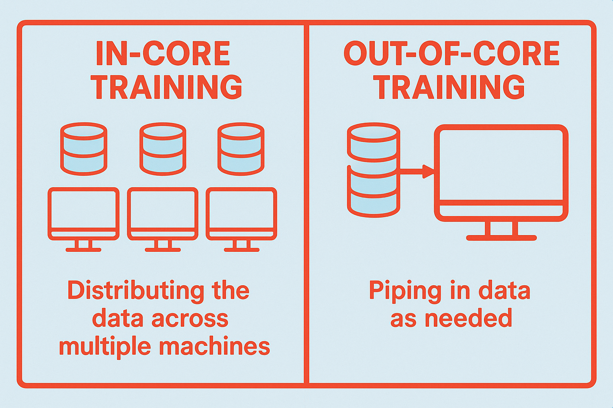

## Introduction
Ray provides a version of XGBoost to scale training with more data. With drop-in replacements of `xgboost` native classes, XGboost Ray allows you to leverage multi-node clusters to distribute training and parallelize hyperparameter tuning. 

As a quick background, vanilla gradient boosted trees are not stochastic algorithms; we can't train the models with batches, similar to what we see in deep learning with gradient descent. Because of this, we need to load the data into memory (i.e. RAM). This problem gets exacerbated when you want to train with GPUs, which have limited GRAM (e.g., A10Gs only have 24GB GRAM). If you have a dataset that's larger than 24GB RAM, there are two options:

1. **In-core training** with GPUs and distributed data parallelism (DDP). In in-core training, we need to have enough GRAM that's ~2-4x the dataset. Since some GPUs (e.g., A10G) don't have sufficient GRAM, we have to distribute that data across multiple GPU nodes. 
2. **Out-of-core training** with GPUs and external memory. This fairly new offering pipes data in as batches, similar to what you see in deep-learning training, and allows you train a model with more data than the GPU GRAM can house. This comes at the cost of tuning batches, monitoring performance, and longer training times.

